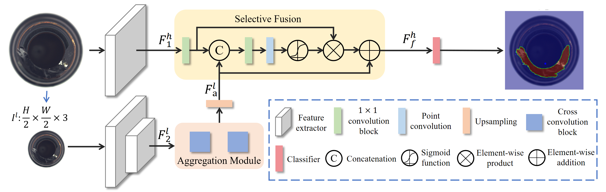

# ✨LFD✨
**This is the official PyTorch implementation of downstream segmentation models LFD for SeaS. The original paper is “Exploiting Low-level Representations for Ultra-Fast Road Segmentation”**

 [**IEEE TITS**] **Exploiting Low-level Representations for Ultra-Fast Road Segmentation**

Authors:  [Huan Zhou](https://github.com/zhouhuan-hust)<sup>1*</sup> | [Feng Xue](https://xuefeng-cvr.github.io/)<sup>3*</sup> | [Yucong Li]()<sup>1*</sup> | [Shi Gong]( )<sup>1</sup> | [Yiqun Li]()<sup>1</sup> | [Yu Zhou](https://github.com/zhouyu-hust)<sup>1,2</sup>

Institutions: <sup>1</sup>Huazhong University of Science and Technology | <sup>2</sup>Wuhan jingCe Electronic Group Co.LTD | <sup>3</sup>University of Trento
### 🧐 [Arxiv](https://arxiv.org/pdf/2402.02430) 

## 📣Updates:
***07/15/2025***

The complete code of downstream segmentation method **LFD** in [paper](https://arxiv.org/pdf/2402.02430) for [SeaS](https://github.com/HUST-SLOW/SeaS) is released.

<span id='all_catelogue'/>

## Catalogue

* <a href='#abstract'>1. Abstract</a>
* <a href='#setup'>2. Environment setup</a>
* <a href='#datasets'>3. Datasets</a>
  * <a href='#Original_Dataset'>Original Dataset</a>
  * <a href='#Dataset_generated_by_SeaS'>Dataset generated by SeaS </a>
* <a href='#quick_use'>4. Run LFD </a>
* <a href='#results_datasets'>5. Results </a>
* <a href='#citation'>6. Citation</a>
* <a href='#thanks'>7. Acknowledgements</a>
* <a href='#license'>8. License</a>


<span id='abstract'/>

## Abstract: <a href='#all_catelogue'>[Back to Catalogue]</a>

LFD was initially developed for road segmentation tasks, leveraging low-level features from the first stage of ResNet-18. We observed that using low-level features is advantageous for anomaly segmentation tasks, so we extended its application to supervised anomaly segmentation. Specifically, LFD adopts a bilateral structure. The spatial detail branch is first designed to extract low-level features using the first stage of ResNet-18. The context semantic branch is then designed to extract contextual features efficiently. In this branch, we asymmetrically downsample the input image and introduce an aggregation module, achieving a receptive field comparable to the third stage of ResNet-18 but with reduced computation time. Finally, a selective fusion module is proposed to compute pixel-wise attention between the low-level representation and contextual features.
In anomaly segmentation, LFD is trained using image–mask pairs generated by SeaS. With a model size of only 0.936M—significantly smaller than BiSeNetV2 (3.341M) and UperNet (64.042M)—LFD achieves a pixel AP score that is 5.34% higher and an F1 score that is 3.99% higher than both.
The original source code is available at https://github.com/zhouhuan-hust/LFD-RoadSeg.

 

<span id='setup'/>

## Setup: <a href='#all_catelogue'>[Back to Catalogue]</a>
### Environment:
- Python 3.9
- Pytorch 1.10.1
- CUDA 11.3

Install the other package via:

``` 
pip install -r requirement.txt
```

Clone the repository:
```
git clone https://github.com/HUST-SLOW/LFD.git
```

Create virtual environment:

```
conda create --name LFD python=3.9
conda activate LFD
```

Install the required packages:

```
conda install pytorch==1.10.1 
pip install -r requirements.txt
```

<span id='datasets'/>

## Datasets: <a href='#all_catelogue'>[Back to Catalogue]</a>

All the datasets are placed under the ./data folder.

For training, we utilized a dataset composed of the following elements:

- Images generated by SeaS.
- 1/3 of the anomaly images from the original dataset (these images were previously used as training data in SeaS).
- All good images from the train folder of the original dataset.

SeaS generated images are load from  `/data/generated_dataset` and the other images are load from `/data/original_dataset`.

For testing, the dataset consists of:

- The remaining 2/3 of the anomaly images from the original dataset.
- All good images from the test folder of the original dataset.

The images are load from `/data/original_dataset`.

<span id='Original_Dataset'/>

### Original Dataset

[MVTec AD](https://www.mvtec.com/company/research/datasets/mvtec-ad/)

```
data
|-- mvtec
|-----|-- bottle
|-----|-----|-- train
|-----|-----|-----|-- good
|-----|-----|-----|-----|-- 000.png
|-----|-----|-----|-----|-- 001.png
|-----|-----|-----|-----|-- ...
|-----|-----|-- test
|-----|-----|-----|-- broken_large
|-----|-----|-----|-----|-- 000.png
|-----|-----|-----|-----|-- 001.png
|-----|-----|-----|-----|-- ...
|-----|-----|-----|-- broken_small
|-----|-----|-----|-- ...
|-----|-----|-- ground_truth
|-----|-----|-----|-- broken_large
|-----|-----|-----|-----|-- 000_mask.png
|-----|-----|-----|-----|-- 001_mask.png
|-----|-----|-----|-----|-- ...
|-----|-----|-----|-- broken_small
|-----|-----|-----|-- ...
|-----|-- cable
|-----|-- ...
```

[VisA](https://github.com/amazon-science/spot-diff)

For VisA we divided the dataset according to defect categories, while dividing the good data in the original dataset into train and good. For downloading the split dataset, please refer to [here](https://huggingface.co/datasets/HUST-SLOW/SeaS/tree/main/VisA_type).

```
data
|-- VisA
|-----|-- candle
|-----|-----|-- train
|-----|-----|-----|-- good
|-----|-----|-- test
|-----|-----|-----|-- chunk_of_waax_missing
|-----|-----|-----|-----|-- 000.png
|-----|-----|-----|-----|-- 001.png
|-----|-----|-----|-----|-- ...
|-----|-----|-----|-- combined
|-----|-----|-----|-- ...
|-----|-----|-- ground_truth
|-----|-----|-----|-- chunk_of_waax_missing
|-----|-----|-----|-----|-- 000.png
|-----|-----|-----|-----|-- 001.png
|-----|-----|-----|-----|-- ...
|-----|-----|-----|-- combined
|-----|-----|-----|-- ...
|-----|-- capsules
|-----|-- ...
```

[MVTec 3D AD](https://www.mvtec.com/company/research/datasets/mvtec-3d-ad)

```
data
|-- mvtec_3d
|-----|-- bagel
|-----|-----|-- test
|-----|-----|-----|-- combined
|-----|-----|-----|-----|--gt
|-----|-----|-----|-----|-----|-- 000.png
|-----|-----|-----|-----|-----|-- 001.png
|-----|-----|-----|-----|-----|-- ...
|-----|-----|-----|-----|-- rgb
|-----|-----|-----|-----|-----|-- 000.png
|-----|-----|-----|-----|-----|-- 001.png
|-----|-----|-----|-----|-----|-- ...
|-----|-----|-----|-----|-- xyz
|-----|-----|-----|-----|-----|-- 000.tiff
|-----|-----|-----|-----|-----|-- 001.tiff
|-----|-----|-----|-----|-----|-- ...
|-----|-----|-----|-- contamination
|-----|-----|-----|-- ...
|-----|-----|-- train
|-----|-----|-----|-- good
|-----|-----|-----|-----|-- rgb
|-----|-----|-----|-----|-- xyz
|-----|-----|-- validation
|-----|-----|-----|-- good
|-----|-----|-----|-----|-- rgb
|-----|-----|-----|-----|-- xyz
|-----|-- cable_gland
|-----|-- ...
```

<span id='Dataset_generated_by_SeaS'/>

### SeaS generated Dataset

All the results are implemented by the default settings in SeaS. For downloading the generated image-mask pairs, please refer to [here](https://huggingface.co/datasets/HUST-SLOW/SeaS/tree/main/Generated_Anomaly_Images).

MVTec AD

```
data
|-- mvtec
|-----|-- bottle
|-----|-----|-- broken_large
|-----|-----|-----|-- image
|-----|-----|-----|-----|-- 000.png
|-----|-----|-----|-----|-- 001.png
|-----|-----|-----|-----|-- ...
|-----|-----|-----|-- mask
|-----|-----|-----|-----|-- 000.png
|-----|-----|-----|-----|-- 001.png
|-----|-----|-----|-----|-- ...
|-----|-----|-- broken_small
|-----|-----|-- ...
|-----|-- cable
|-----|-----|-- bent_wire
|-----|-----|-----|-- image
|-----|-----|-----|-- mask
|-----|-----|-- ...
|-----|-- ...
```

VisA

```
data
|-- VisA
|-----|-- candle
|-----|-----|-- chunk_of_waax_missing
|-----|-----|-----|-- image
|-----|-----|-----|-----|-- 000.png
|-----|-----|-----|-----|-- 001.png
|-----|-----|-----|-----|-- ...
|-----|-----|-----|-- mask
|-----|-----|-----|-----|-- 000.png
|-----|-----|-----|-----|-- 001.png
|-----|-----|-----|-----|-- ...
|-----|-----|-- combined
|-----|-----|-- ...
|-----|-- capsules
|-----|-- ...
```

MVtec 3D AD

```
data
|-- mvtec_3d_AD
|-----|-- bagel
|-----|-----|-- combined
|-----|-----|-----|-- image
|-----|-----|-----|-----|-- 000.png
|-----|-----|-----|-----|-- 001.png
|-----|-----|-----|-----|-- ...
|-----|-----|-----|-- mask
|-----|-----|-----|-----|-- 000.png
|-----|-----|-----|-----|-- 001.png
|-----|-----|-----|-----|-- ...
|-----|-----|-- contamination
|-----|-----|-- ...
|-----|-- cable_gland
|-----|-----|-- bent
|-----|-----|-----|-- image
|-----|-----|-----|-- mask
|-----|-----|-- ...
|-----|-- ...
```

<span id='quick_use'/>

## Run LFD: <a href='#all_catelogue'>[Back to Catalogue]</a>
### Train

set training: state: True and run the code below:

```bash
python examples/LFD_main.py 
```


### Test

set testing: state: True and run the code below:

```bash
python examples/LFD_main.py 
```

### Eval Speed

set eval_speed: state: True and run the code below:

```bash
python examples/LFD_main.py
```


All checkpoints and metrics will be stored in the `./outputs/<RUN_EXP>.`


<span id='results_datasets'/>

## Results: <a href='#all_catelogue'>[Back to Catalogue]</a>

We report the quantitative results on the MVTec AD, VisA and MVTec 3D AD datasets. All the results are implemented by the default settings in SeaS. We run all experiments on single A100.

**MVTec AD**

| Segmentation Models | Generative Models |           | Image-level |           |           | Pixel-level |           |           |
| ------------------- | ----------------- | --------- | ----------- | --------- | --------- | ----------- | --------- | --------- |
|                     |                   | AUROC     | AP          | F1-max    | AUROC     | AP          | F1-max    | IoU       |
|                     | DFMGAN            | 90.90     | 94.43       | 90.33     | 94.57     | 60.42       | 60.54     | 45.83     |
| BiSeNet V2          | AnomalyDiffusion  | 90.08     | 94.84       | 91.84     | 96.27     | 64.50       | 62.27     | 42.89     |
|                     | SeaS              | **96.00** | **98.14**   | **95.43** | **97.21** | **69.21**   | **66.37** | **55.28** |
|                     | DFMGAN            | 90.74     | 94.43       | 90.37     | 92.33     | 57.01       | 56.91     | 46.64     |
| UperNet             | AnomalyDiffusion  | 96.62     | 98.61       | 96.21     | 96.87     | 69.92       | 66.95     | 50.80     |
|                     | SeaS              | **98.29** | **99.20**   | **97.34** | **97.87** | **74.42**   | **70.70** | **61.24** |
|                     | DFMGAN            | 91.08     | 95.40       | 90.58     | 94.91     | 67.06       | 65.09     | 45.49     |
| LFD                 | AnomalyDiffusion  | 95.15     | 97.78       | 94.66     | 96.30     | 69.77       | 66.99     | 45.77     |
|                     | SeaS              | **95.88** | **97.89**   | **95.15** | **98.09** | **77.15**   | **72.52** | **56.47** |
|                     | DFMGAN            | 90.91     | 94.75       | 90.43     | 93.94     | 61.50       | 60.85     | 45.99     |
| Average             | AnomalyDiffusion  | 93.95     | 97.08       | 94.24     | 96.48     | 68.06       | 65.40     | 46.49     |
|                     | SeaS              | **96.72** | **98.41**   | **95.97** | **97.72** | **73.59**   | **69.86** | **57.66** |


**VisA**

| Segmentation Models | Generative Models |           | Image-level |           |           | Pixel-level |           |           |
| ------------------- | ----------------- | --------- | ----------- | --------- | --------- | ----------- | --------- | --------- |
|                     |                   | AUROC     | AP          | F1-max    | AUROC     | AP          | F1-max    | IoU       |
|                     | DFMGAN            | 63.07     | 62.63       | 66.48     | 75.91     | 9.17        | 15.00     | 9.66      |
| BiSeNet V2          | AnomalyDiffusion  | 76.11     | 77.74       | 73.13     | 89.29     | 34.16       | 37.93     | 15.93     |
|                     | SeaS              | **85.61** | **86.64**   | **80.49** | **96.03** | **42.80**   | **45.41** | **25.93** |
|                     | DFMGAN            | 71.69     | 71.64       | 70.70     | 75.09     | 12.42       | 18.52     | 15.47     |
| UperNet             | AnomalyDiffusion  | 83.18     | 84.08       | 78.88     | 95.00     | 39.92       | 45.37     | 20.53     |
|                     | SeaS              | **90.34** | **90.73**   | **84.33** | **97.01** | **55.46**   | **55.99** | **35.91** |
|                     | DFMGAN            | 65.38     | 62.25       | 66.59     | 81.21     | 15.14       | 18.70     | 6.44      |
| LFD                 | AnomalyDiffusion  | 81.97     | 82.36       | 77.35     | 88.00     | 30.86       | 38.56     | 16.61     |
|                     | SeaS              | **83.07** | **82.88**   | **77.24** | **92.91** | **43.87**   | **46.46** | **26.37** |
|                     | DFMGAN            | 66.71     | 65.51       | 67.92     | 77.40     | 12.24       | 17.41     | 10.52     |
| Average             | AnomalyDiffusion  | 80.42     | 81.39       | 76.45     | 90.76     | 34.98       | 40.62     | 17.69     |
|                     | SeaS              | **86.34** | **86.75**   | **80.69** | **95.32** | **47.38**   | **49.29** | **29.40** |

**MVTec 3D AD**

| Segmentation Models | Generative Models |           | Image-level |           |           | Pixel-level |           |           |
| ------------------- | ----------------- | --------- | ----------- | --------- | --------- | ----------- | --------- | --------- |
|                     |                   | AUROC     | AP          | F1-max    | AUROC     | AP          | F1-max    | IoU       |
|                     | DFMGAN            | 61.88     | 81.80       | 84.44     | 75.89     | 15.02       | 21.73     | 15.68     |
| BiSeNet V2          | AnomalyDiffusion  | 61.49     | 81.35       | 85.36     | **92.39** | 15.15       | 20.09     | 14.70     |
|                     | SeaS              | 73.60     | **87.75**   | **85.82** | 90.41     | **26.04**   | **32.61** | **28.55** |
|                     | DFMGAN            | 67.56     | 84.53       | 84.99     | 75.12     | 19.54       | 26.04     | 18.78     |
| UperNet             | AnomalyDiffusion  | 76.56     | 90.42       | 87.35     | 88.48     | 28.95       | 35.81     | 25.04     |
|                     | SeaS              | **82.57** | **92.59**   | **88.72** | **91.93** | **38.51**   | **43.53** | **38.56** |
|                     | DFMGAN            | 62.23     | 82.17       | 85.38     | 72.15     | 9.54        | 14.29     | 14.81     |
| LFD                 | AnomalyDiffusion  | 77.06     | 89.44       | 87.20     | **92.68** | 24.29       | 32.74     | 19.90     |
|                     | SeaS              | **78.96** | **91.22**   | **87.28** | 91.61     | **40.25**   | **43.47** | **39.00** |
|                     | DFMGAN            | 63.89     | 83.83       | 84.94     | 74.39     | 14.70       | 20.69     | 16.42     |
| Average             | AnomalyDiffusion  | 71.70     | 87.07       | 86.64     | 91.18     | 22.80       | 29.55     | 19.88     |
|                     | SeaS              | **78.38** | **90.52**   | **87.27** | **91.32** | **34.93**   | **39.87** | **35.37** |

<span id='citation'/>

## Citation: <a href='#all_catelogue'>[Back to Catalogue]</a>

If you find this repo useful for your research, please consider citing our paper:
```bibtex
@ARTICLE{zhou2024lfdroadseg,
  author={Zhou, Huan and Xue, Feng and Li, Yucong and Gong, Shi and Li, Yiqun and Zhou, Yu},
  journal={IEEE Transactions on Intelligent Transportation Systems (TITS)}, 
  title={Exploiting Low-level Representations for Ultra-Fast Road Segmentation}, 
  year={2024},
  }
```

<span id='thanks'/>

## Acknowledgements: <a href='#all_catelogue'>[Back to Catalogue]</a>

The codebase is built on repos:  https://github.com/zhouhuan-hust/LFD_RoadSeg.git

<span id='license'/>

## License: <a href='#all_catelogue'>[Back to Catalogue]</a>

LFD is released under the **MIT License**, and is fully open for academic research and also allow free commercial usage. To apply for a commercial license, please contact yuzhou@hust.edu.cn.

​    


